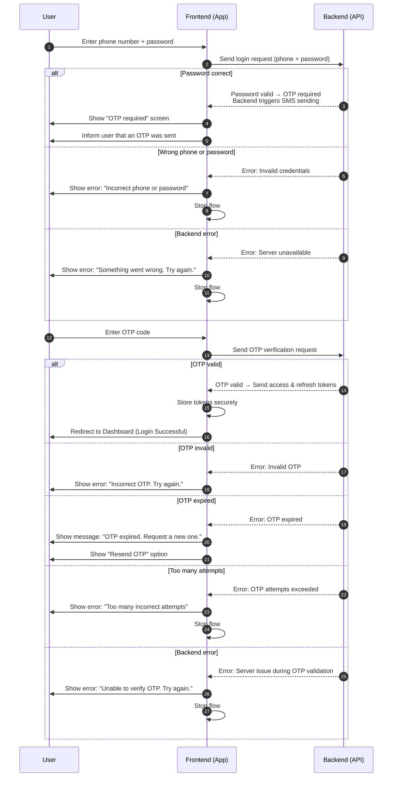

```mermaid

sequenceDiagram

autonumber

  

participant U as User

participant FE as Frontend (App)

participant BE as Backend (API)

  

%% --- Step 1: User submits credentials ---

U->>FE: Enter phone number + password

FE->>BE: Send login request (phone + password)

  

alt Password correct

BE-->>FE: Password valid → OTP required<br/>Backend triggers SMS sending

FE->>U: Show "OTP required" screen

FE->>U: Inform user that an OTP was sent

else Wrong phone or password

BE-->>FE: Error: Invalid credentials

FE->>U: Show error: "Incorrect phone or password"

FE->>FE: Stop flow

else Backend error

BE-->>FE: Error: Server unavailable

FE->>U: Show error: "Something went wrong. Try again."

FE->>FE: Stop flow

end

  

%% --- Step 2: User enters OTP ---

U->>FE: Enter OTP code

FE->>BE: Send OTP verification request

  

alt OTP valid

BE-->>FE: OTP valid → Send access & refresh tokens

FE->>FE: Store tokens securely

FE->>U: Redirect to Dashboard (Login Successful)

  

else OTP invalid

BE-->>FE: Error: Invalid OTP

FE->>U: Show error: "Incorrect OTP. Try again."

  

else OTP expired

BE-->>FE: Error: OTP expired

FE->>U: Show message: "OTP expired. Request a new one."

FE->>U: Show "Resend OTP" option

  

else Too many attempts

BE-->>FE: Error: OTP attempts exceeded

FE->>U: Show error: "Too many incorrect attempts"

FE->>FE: Stop flow

  

else Backend error

BE-->>FE: Error: Server issue during OTP validation

FE->>U: Show error: "Unable to verify OTP. Try again."

FE->>FE: Stop flow

end

  

```
<!--stackedit_data:
eyJoaXN0b3J5IjpbLTE1MDg4OTc1MzksMTQ1NTI2NzkyNSwtMz
MyNDU1MzYzXX0=
-->