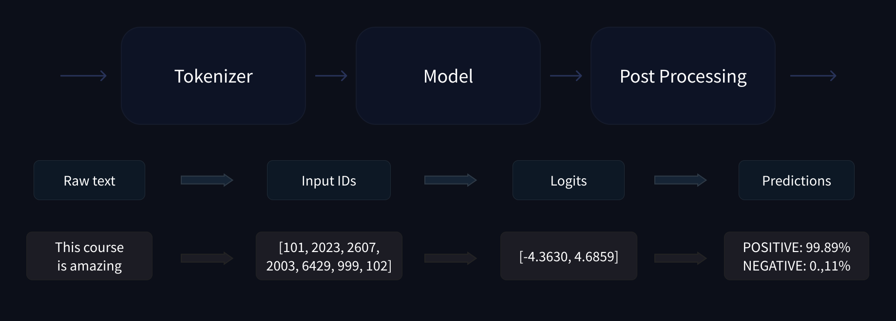
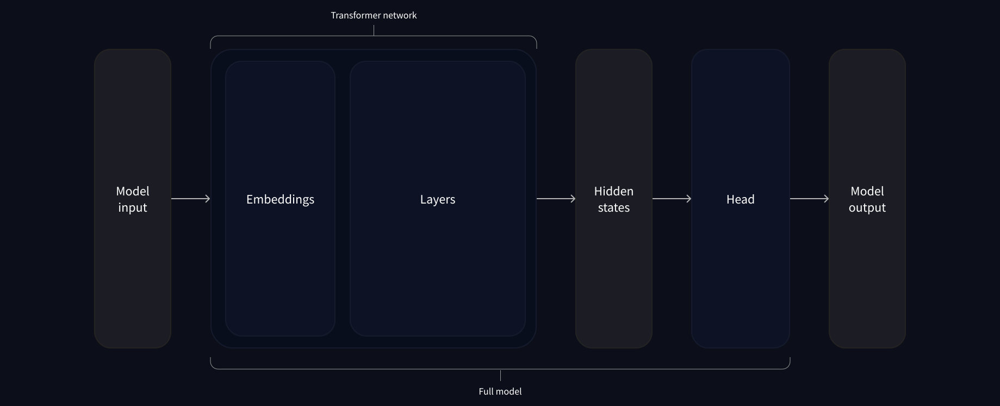

# LLMs Architectures  


Model | Examples |Tasks
|--|--|--|
**Encoder-only** | BERT, DistilBERT, ModernBERT | Sentence classification, named entity recognition, extractive question answering
**Decoder-only** | GPT, LLaMA, Gemma, SmolLM | Text generation, conversational AI, creative writing 
**Encoder-decoder** | BART, T5, Marian, mBART | Summarization, translation, generative question answering


# LLM pipeline
## Full LLM pipeline

> **Tokenizer types** : Word-based,  Character-based, Subword tokenization
## inside model pipe


## transformers Library

```python
import torch
from transformers import AutoTokenizer, AutoModelForSequenceClassification

# load tokenizer and model
checkpoint = "distilbert-base-uncased-finetuned-sst-2-english"
tokenizer = AutoTokenizer.from_pretrained(checkpoint)
model = AutoModelForSequenceClassification.from_pretrained(checkpoint)

# sentance to tokes
sequence = "I've been waiting for a HuggingFace course my whole life."
model_inputs = tokenizer(sequence)
# or model_inputs = tokenizer(sequences, padding="max_length", max_length=8)
# or model_inputs = tokenizer(sequences, max_length=8, truncation=True)

# return as tensors
model_inputs = tokenizer(sequences, padding=True, return_tensors="pt") # pt: pytorch tensors 

# pass input to model 
output = model(**tokens)
```
# Fine-tuning 
## Processing the data
-   Use  `batched=True`  with  `Dataset.map()`  for significantly faster preprocessing
-   Dynamic padding with  `DataCollatorWithPadding`  is more efficient than fixed-length padding
-   Always preprocess your data to match what your model expects (numerical tensors, correct column names)
-   The 🤗 Datasets library provides powerful tools for efficient data processing at scale
```python
from datasets import load_dataset
from transformers import AutoTokenizer, DataCollatorWithPadding

# loading tokenizer and dataset
raw_datasets = load_dataset("glue", "mrpc")
checkpoint = "bert-base-uncased"
tokenizer = AutoTokenizer.from_pretrained(checkpoint)

# tokenizing func
def tokenize_function(example):
    return tokenizer(example["sentence1"], example["sentence2"], truncation=True)
    
# run with map and batched for processes multiple examples at once, making tokenization much faster. 
tokenized_datasets = raw_datasets.map(tokenize_function, batched=True)
# padding for max leght in batch
data_collator = DataCollatorWithPadding(tokenizer=tokenizer)
```
## Fine-tuning a model
###  With the Trainer API
-   The  `Trainer`  API provides a high-level interface that handles most training complexity
-   Use  `processing_class`  to specify your tokenizer for proper data handling
-   `TrainingArguments`  controls all aspects of training: learning rate, batch size, evaluation strategy, and optimizations
-   `compute_metrics`  enables custom evaluation metrics beyond just training loss
-   Modern features like mixed precision (`fp16=True`) and gradient accumulation can significantly improve training efficiency
```python
from transformers import Trainer
from transformers import AutoModelForSequenceClassification
# after doing preprocess like last section
# making the  model from checkpoint
model = AutoModelForSequenceClassification.from_pretrained(checkpoint, num_labels=2)

# config the trainer
trainer = Trainer(
    model,
    training_args,
    train_dataset=tokenized_datasets["train"],
    eval_dataset=tokenized_datasets["validation"],
    data_collator=data_collator, # default is DataCollatorWithPadding
    processing_class=tokenizer,
)

# start fine-tuning
trainer.train()
```
#### evaluation 

```python
def compute_metrics(eval_preds):
    metric = evaluate.load("glue", "mrpc")
    logits, labels = eval_preds
    predictions = np.argmax(logits, axis=-1)
    return metric.compute(predictions=predictions, references=labels)

training_args = TrainingArguments("test-trainer", eval_strategy="epoch")
model = AutoModelForSequenceClassification.from_pretrained(checkpoint, num_labels=2)

trainer = Trainer(
    model,
    training_args,
    train_dataset=tokenized_datasets["train"],
    eval_dataset=tokenized_datasets["validation"],
    data_collator=data_collator,
    processing_class=tokenizer,
    compute_metrics=compute_metrics,
)
```
#### Advanced features
```python
training_args = TrainingArguments(
	"test-trainer",
	eval_strategy="epoch",
	# Enable mixed precision ( faster training and reduced memory usage )
    fp16=True,
	# Effective batch size = 4 * 4 = 16
	per_device_train_batch_size=4,
	gradient_accumulation_steps=4,  
	# Try different schedulers  
	learning_rate=2e-5,
	lr_scheduler_type="cosine",  
)
```
### Manually with full training loop:

```python
# postProcessiong dataset to fit our training
tokenized_datasets = tokenized_datasets.remove_columns(["sentence1", "sentence2", "idx"]) # Remove the columns corresponding to values the model does not expect
tokenized_datasets = tokenized_datasets.rename_column("label", "labels") # `labels`
tokenized_datasets.set_format("torch")
tokenized_datasets["train"].column_names
```
<!--stackedit_data:
eyJoaXN0b3J5IjpbMTA1ODk1MzEyOCwtMjA4OTQ3MDIzNSwtMT
k1MjEyMDY5MiwtNzUxMTQ2NzEzLDIyNDU2NTc1MSwxODg3OTkw
MTA0LDE0NTQ0Mjk5NTcsLTE5MTY5NjEyODUsODAyNzM5MjU1LD
EwMzQyNzYzMTEsLTI3MzI1NjUwOSwtMTk1MTE4Mjg0MiwtMTU4
MTc4MDk3NiwxNTExODg4OTcxLDI5MTM2MTQzNSw3MzA5OTgxMT
ZdfQ==
-->